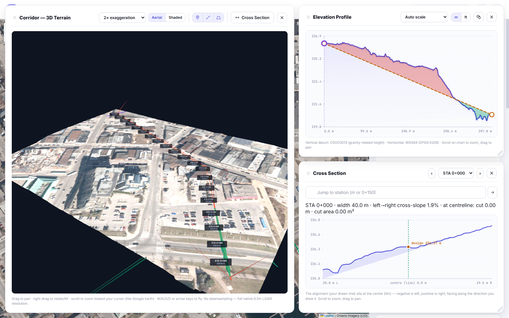

# Contour

**Draw a line on a map. Get its real ground elevation profile, a 3D terrain view, and cross-sections — built on Ontario's free public LiDAR.**



## What it does

Contour takes a route you draw on a map and turns it into real engineering data: how the ground actually rises and falls along that line, sampled from Ontario's 0.5m-resolution LiDAR digital terrain model — not an estimate, the real surveyed ground.

No installation, no account, no build step. It's one HTML file that runs entirely in the browser.

## Features

**Core**
- Draw a route on the map (or import one from a DXF/CAD file) and get a real elevation profile in seconds
- Aerial imagery basemap (Ontario Orthophotography) or a standard street map
- Address search, metric/imperial toggle, CSV export, chart PNG export

**Views — all can be open and tiled together**
- **Elevation Profile** — the main chart, with scroll-to-zoom, drag-to-pan, and a measuring tool
- **3D Terrain** — full native-resolution (no downsampling) terrain around your corridor, Google Earth-style navigation, draped aerial imagery
- **Cross Section** — a real perpendicular slice across the line at any station, with a live draggable slider on the map and a "jump to station" input (plain metres or `0+150` chainage notation)

**Design & analysis**
- Design grade (cut/fill) against the real ground, multi-segment, with a true per-side "daylight search" (not a flat-ground guess) for accurate volumes and channel shapes
- Manning's-style trapezoidal channel — bottom width and side slope, visualized in 2D, 3D, and cross-section together
- LiDAR survey coverage — see exactly which regional survey and vintage your data came from

**Export**
- LiDAR corridor export as a georeferenced GeoTIFF
- Combined PDF report (map, chart, stats, cross-sections)
- Save/reopen a project as a `.json` file

**Onboarding**
- A short first-run tutorial for new users, reachable anytime from the header

## Data sources

- **Ground elevation:** [Ontario LiDAR DTM](https://ws.geoservices.lrc.gov.on.ca/arcgis5/rest/services/Elevation/Ontario_DTM_LidarDerived/ImageServer) (Land Information Ontario) — Open Government Licence – Ontario
- **Aerial imagery:** Ontario Orthophotography (LIO)
- **Basemap / search:** OpenStreetMap contributors, Nominatim

Full attribution and links live in the app itself, under **Sources & References**.

## Running it

Clone the repo and open `data/LineProfile.html` directly in a browser. That's it — no `npm install`, no server.

```
git clone https://github.com/chikenwings3851/contour.git
```

## Status

Actively developed, single-file architecture by design (no build tooling, no dependencies beyond a few CDN-loaded libraries: Leaflet, Three.js, proj4). Ontario-only, tied to the free public LiDAR/imagery coverage area.

---

Built by [Max Cheng](https://github.com/chikenwings3851).
