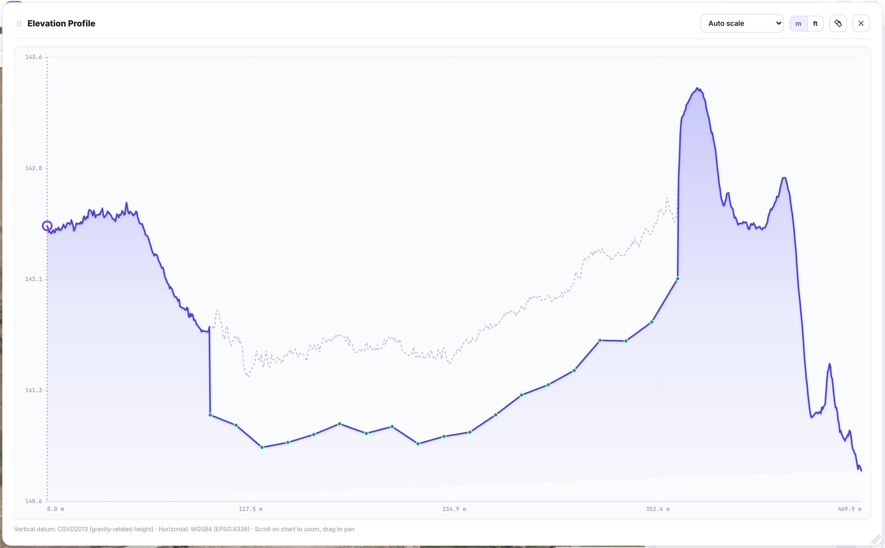
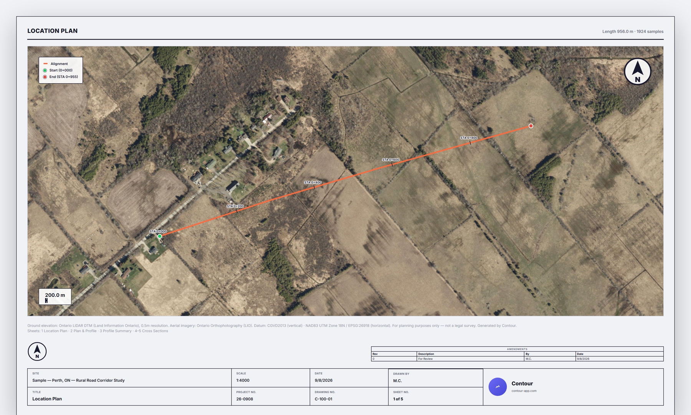

# Contour

**Draw a line on a map. Get its real ground elevation profile, a 3D terrain view, and cross-sections — built on Ontario's free public LiDAR.**


## What it does

Contour takes a route you draw on a map and turns it into real engineering data: how the ground actually rises and falls along that line, sampled from Ontario's 0.5m-resolution LiDAR digital terrain model — not an estimate, the real surveyed ground.

No installation, no account, no build step. It's one HTML file that runs entirely in the browser.

## Features

**Getting a line in — four ways**
- **Draw it** on the map
- **Search a municipal drain by name** and load the drain itself as your alignment, straight from Ontario's open Constructed Drain data — no login or token. A named drain is stored as several separate reach features, so Contour groups them by name and stitches the reaches end-to-end into one continuous alignment
- **Import a file** — GeoJSON, shapefile (`.shp`+`.prj`, or zipped), KML, KMZ, or DXF. GeoJSON/KML/KMZ are lat/lon by specification and a shapefile states its own CRS in its `.prj`, so only DXF needs you to pick a UTM zone
- **Open a saved project** (`.json`)

**Core**
- Aerial imagery (Ontario Orthophotography) or Ontario's topographic basemap
- Address search, metric/imperial toggle, CSV export, chart PNG export

**Views — all can be open and tiled together**
- **Elevation Profile** — the main chart, with scroll-to-zoom, drag-to-pan, click-to-pin the exact station/elevation at any point, and a measuring tool
- **3D Terrain** — full native-resolution (no downsampling) terrain around your corridor, Google Earth-style navigation, draped aerial imagery
- **Cross Section** — a real perpendicular slice across the line at any station, with a live draggable slider on the map and a "jump to station" input (plain metres or `0+150` chainage notation)

**Design & analysis**
- Design grade (cut/fill) against the real ground, multi-segment, with a true per-side "daylight search" (not a flat-ground guess) for accurate volumes and channel shapes
- Trapezoidal channel — bottom width and side slope, visualized in 2D, 3D, and cross-section together
- **Minimum cover check** — for a design grade used as a pipe invert (a drain enclosure, culvert run, or tile main), set a pipe diameter and required cover and the profile draws the pipe barrel, the ground elevation your design actually requires, and highlights in red every stretch where the pipe sits too shallow for the ground above it
- LiDAR survey coverage — see exactly which regional survey and vintage your data came from

**Surveyed ground where LiDAR can't see it**

LiDAR can't read through standing water — the return comes off the water surface — and in a soft or vegetated ditch bottom the ground classification lands on top of the muck rather than hard bottom. Both make an invert read *shallower* than it really is, which is the one number a drain design can't afford to have wrong.

Import a CSV of survey shots (PNEZD, PENZD, or lat/lon, header or not — column roles are worked out from the values, so a northing can't be mistaken for an elevation) and the surveyed ditchline overrides the LiDAR across the reach it covers. Shots are filtered by description code (`INV`, `HB`, `DITCH`…), then by how far off the alignment they sit, then lowest-wins where several land at the same station — which is the invert more or less by definition.

The original LiDAR line stays drawn underneath as a faint dashed line with your shots marked on it. That gap between the two lines is the water or soft-bottom depth, and it stays visible and auditable rather than being silently replaced. Everything downstream — cut/fill volumes, cross-sections, the 3D view, the PDF report — then works off the corrected ground.



Contour also reports the mean difference between your shots and the LiDAR. That single number is deliberately ambiguous — it's either the water/soft bottom LiDAR couldn't see through, or a vertical datum mismatch — and it says so, leaving the call to you.

**Export**
- LiDAR corridor export as a georeferenced GeoTIFF
- Combined PDF report — location plan, plan & profile, cross-sections, and a real engineering title block (scale, stationing, north arrow, revisions)
- Save/reopen a project as a `.json` file



**Onboarding**
- A short first-run tutorial for new users, reachable anytime from the header

## Data sources

- **Ground elevation:** [Ontario LiDAR DTM](https://ws.geoservices.lrc.gov.on.ca/arcgis5/rest/services/Elevation/Ontario_DTM_LidarDerived/ImageServer) (Land Information Ontario) — Open Government Licence – Ontario
- **Aerial imagery:** Ontario Orthophotography (LIO)
- **Topographic basemap:** [Ontario Topographic](https://ws.lioservices.lrc.gov.on.ca/arcgis1/rest/services/LIO_Cartographic/LIO_Topographic/MapServer) (LIO)
- **Municipal drains:** [Constructed Drain](https://ws.lioservices.lrc.gov.on.ca/arcgis2/rest/services/LIO_OPEN_DATA/LIO_Open01/MapServer/7) (LIO open data — the no-token copy, not the licensed AgMaps service)
- **Address search:** Nominatim / OpenStreetMap

Everything except the address search runs on Ontario's own public infrastructure — no API key, no token, nothing to expire. Full attribution and links live in the app itself, under **Sources & References**.

## Running it

Clone the repo and open `data/LineProfile.html` directly in a browser. That's it — no `npm install`, no server.

```
git clone https://github.com/chikenwings3851/contour.git
```

## Status

Actively developed, single-file architecture by design (no build tooling, no dependencies beyond a few CDN-loaded libraries: Leaflet, Three.js, proj4, JSZip). Ontario-only, tied to the free public LiDAR/imagery coverage area.

Ground elevation is LiDAR-derived and not a legal survey — every PDF sheet says so, alongside its vertical datum and coordinate system.

---

Built by [Max Cheng](https://github.com/chikenwings3851).
